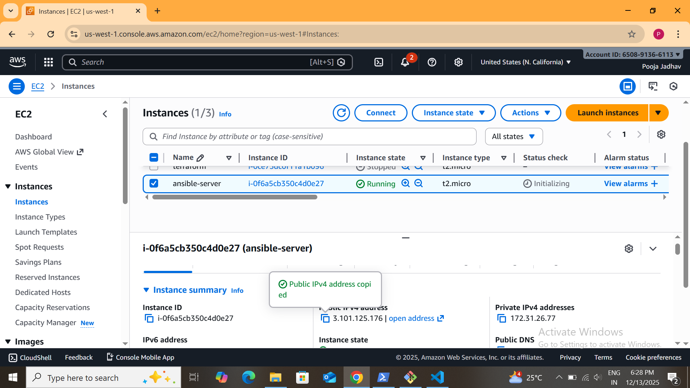

# HTTPD  Deployment using Ansible Role 

# Project Overview

This repository showcases a complete end-to-end Ansible Role project where secure authentication is implemented for both GitHub and Ansible Galaxy using access tokens.

The role is developed on an Ansible server, pushed to GitHub using GitHub Personal Access Token, and successfully published to Ansible Galaxy using Galaxy API token. This project reflects real-world DevOps security and automation practices.

## Technologies Used

- Ansible

- Ansible Roles

- Apache HTTPD

- Linux (Amazon Linux )

- YAML

- Git & GitHub

- Ansible Galaxy

## Project Structure

    httpd-role-project/
    ├── /Img
    ├── with_role.yml
    └── roles/
    └── httpd/
        ├── tasks/
        │   └── main.yml
        ├── handlers/
        │   └── main.yml
        ├── files/
        │   └── index.html
        ├── vars/
        │   └── main.yml
        ├── defaults/
        │   └── main.yml
        └── meta/
            └── main.yml

## Role Functionality
The httpd role performs the following tasks:

   - Installs Apache HTTPD package

- Starts and enables the httpd service

- Deploys a custom index.html file

- Uses handlers to restart Apache when required

## Launced A EC2 Instance

## Default Variables
      httpd_package: httpd
      httpd_service: httpd
      httpd_port: 80
## Playbook Example

    - name: Deploy HTTPD using Ansible Role
    hosts: localhost
    become: yes
    roles:
     - httpd

## Run

      ansible-playbook with_role.yml

## Output

- Apache HTTPD service running successfully

- Website accessible using EC2 public IP

## Push The File In Github

### Secure Authentication Workflow

- GitHub Access Token

- GitHub Personal Access Token (PAT) created

- Used to authenticate Git operations from Ansible server

- Code pushed securely to GitHub repository

## GitHub Push Using Access Token

## Ansible Galaxy Publication

This role is officially published on Ansible Galaxy and can be installed directly.

    ansible-galaxy install iampooja-jadhav.Httpd_Role
   

## Ansible Galaxy Token

- Ansible Galaxy API token generated

- Used to import and publish role on Galaxy

- Role successfully synced with GitHub repository

## Ansible galaxy Push Using Access Token

## Key Highlights

- Role-based automation

- Clean and reusable structure

- Best practices followed

- Suitable for DevOps / Cloud interviews

- Can be published on Ansible Galaxy

# Conclusion

This project demonstrates an end-to-end Ansible role workflow where an Apache HTTPD role is securely pushed to GitHub using a Personal Access Token and published on Ansible Galaxy using a Galaxy API token. It follows real-world DevOps security and automation best practices .

# Author

Pooja Jadhav

